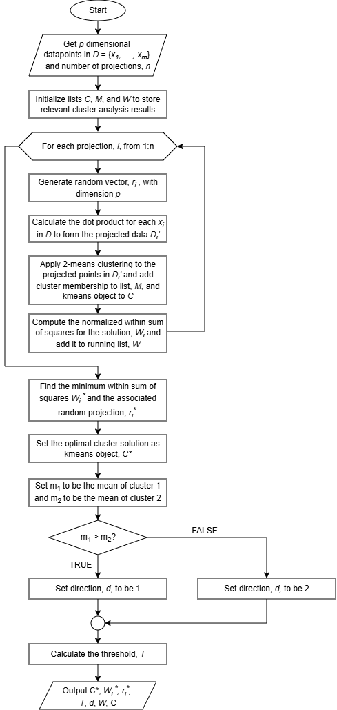
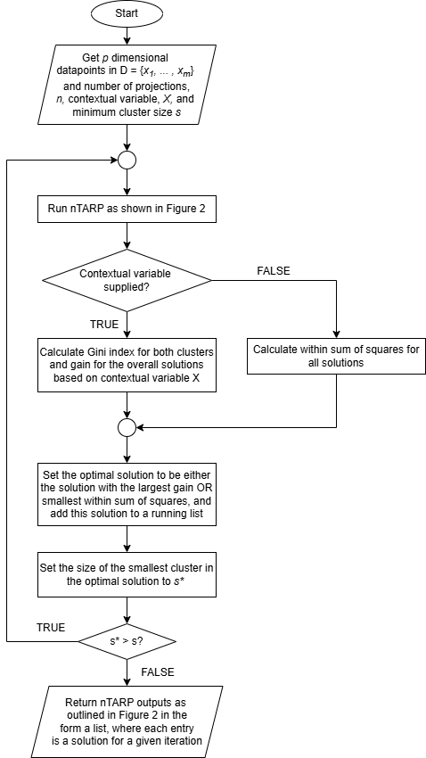

# The nTARP (Thresholding After Random Projections) package 

# 1. Introduction to the n-TARP clustering method
This R Notebook demonstrates the functionality of the nTARP package, which implements a high-dimensional clustering technique called Thresholding After Random Projections (n-TARP). The method is described in Yellamraju & Boutin (2018) and Tarun (2019). In many datasets, the number of variables (dimensionality) can be much larger than the number of observations, which can make traditional distance-based clustering approaches unreliable or prone to non-convergence. To address this, n-TARP projects the high-dimensional data (in \( D \)) into one-dimensional spaces (in \( D' \)) repeatedly and applies k-means in each projection to identify clusters (typically splitting the data into two clusters at each step). 

**Figure 1:** The premise of n-TARP, projecting data from higher dimensions into 1-D using random projections to find the best clustering 


The algorithm flows like so:

Let \( x_1, \dots, x_m \in \mathbb{R}^p \) denote the observations in the dataset, \( D \). And initialize lists, \( C \) (to store individual candidate cluster solutions), \( M \) (to store the cluster membership for each \( x_i \)), and \( W \) (to store the within sum of squares for each candidate solution).

1. For each projection, \( i = 1, \dots, n \):

   a. Generate a random vector \( r_i \in \mathbb{R}^p \).

   b. Project each observation \( x_j \) onto \( r_i \) using the dot product to form the projected dataset \( D_i' \):
   $$
   x_j^\top r_i
   $$
   c. Apply 2-means clustering to the projected values in \( D_i' \) to obtain two clusters. Store the cluster membership found in \( M \) and the kmeans object in \( C \).

   d. Compute the normalized within-cluster sum of squares \( W_i \) for this clustering and add it to the list \( W \). To find \( W_i \), we take the within sum of squares of the solution \( \text{WSS}_i\) and divide it by the variance of the projected data \( \sigma_{D_i'}^2 \) multiplied by the sample size \( |D| \).

\[
W_i = \frac{\text{WSS}_i}{\sigma_{D_i'}^2 \cdot |D|}
\]

2. End loop.

3. Identify and store the optimal random vector \( r_i* \) associated with the smallest within sum of squares value \( W_i* \). Set the optimal cluster solution \( C* \) as the kmeans object associated with \( r_i* \) and \( W_i* \).

4. Set \( m_1 \) to be the mean of cluster 1 and \( m_2 \) to be the mean of cluster 2 from the optimal solution. If the \( m_1 > m_2 \), set the direction vector \( d \) to be 1. Else, set \( d \) as 2.  

5. Compute and store the threshold \( t \) that separates the two clusters along the selected projection. The threshold is essentially the halfway point between the extreme values of the two clusters. Let \( D_i^{(1)} \) be the projected points belonging to cluster 1 and \( D_i^{(2)} \) be the projected points belonging to cluster 2, then:

$$
\text{If } d = 1: \quad 
\frac{\min(D_i^{(1)}) - \max(D_i^{(2)})}{2} + \max(D_i^{(2)}) \\[1em]
\text{If } d = 2: \quad 
\frac{\min(D_i^{(2)}) - \max(D_i^{(1)})}{2} + \max(D_i^{(1)})
$$

A flowchart can summarizing the process can be seen below in Figure 2.

**Figure 2:** How the nTARP process works



As you might gather from the loop at the core of the algorithm, several candidate solutions are generated and one is chosen based on the within sum of squares. Although n-TARP has been used sparingly, its applications have been notably diverse. In some cases, researchers have addressed the randomness of the algorithm by tracking cluster membership across iterations and aggregating results into composite profiles. In others, n-TARP has been applied as a conventional clustering tool to identify meaningful splits between participant groups.

A conceptually distinct use of n-TARP is as a classifier. After training, the algorithm yields two key parameters: (1) the optimal random projection associated with the smallest normalized within-cluster sum of squares and (2) the threshold separating clusters along that projection. In some applications, researchers have used n-TARP to classify individuals and then examine how the resulting patterns relate to external outcomes, extending the method beyond description into inferential analysis.

Together, these examples illustrate the flexibility of n-TARP, which are now accessible through this package.

# 1.1 Installing the package and running the core n-TARP function

Let's load the package.

```{r}
library(nTARP)
```

To illustrate how the method works, we will use the classic `iris` dataset, which contains three types of flowers. Our goal is to cluster the observations based on the four measured variables. 

```{r}
data(iris)
head(iris)
```

Note that there are 150 observations with three classes, 50 observations each. 

```{r}
table(iris$Species)
```

The primary function in the package is `nTARP`. To use it, the main input is the dataset to be clustered.

You must then specify the number of projections, which determines how many random vectors are used to project the data into one-dimensional spaces for clustering. A common starting value is 1,000 projections, increasing to 10,000 or more for datasets with larger sample sizes or higher dimensionality. There is generally no statistical disadvantage to increasing the number of projections—only additional computational time and resource use.

Finally, the `withinss_threshold` argument sets the maximum normalized within-cluster sum of squares that a candidate solution can have to be considered acceptable. Based on prior work (Yellamraju & Boutin, 2018, IEEE Transactions on Image Processing, 27(4), 1927–1938), a value of 0.36 or lower is often a reasonable benchmark for determining whether a solution contains sufficient structure.

```{r}
set.seed(123532) #random seed for reproducibility
cluster_solution <- nTARP(data = iris[,1:4],
                          number_of_projections = 1000,
                          withinss_threshold = 0.36
                          )
```

# 1.1 Getting the optimal solution from the nTARP function

From here, there are several ways to explore the results. We can examine the outputs one by one.

The first output is the result of the `kmeans` function corresponding to the best clustering solution identified according to the within-cluster sum of squares criterion. This object contains:

- The cluster centers
- The clustering vector (final cluster labels for each observation)
- The within-cluster sum of squares
- The proportion of variance explained

If you would like to inspect this solution directly, you can access it as follows:

```{r}
cluster_solution$OptimalSolution
paste("The optimal within sum of squares was", round(cluster_solution$OptimalWithinss,2))
```

# 1.2 Using the results of nTARP as a classifier

The next outputs of the nTARP function are particularly useful for those who want to use nTARP as a classifier — that is, to classify new data points using the best random projection. The three relevant outputs are `OptimalProjection`, `Threshold`, and `Direction`.

-`OptimalProjection` is the random vector associated with the solution that has the smallest within-cluster sum of squares.
-`Threshold` specifies the boundary that separates cluster 1 from cluster 2 in the one-dimensional projected space.
-`Direction` indicates which cluster has the larger mean along the optimal projection.

To classify a new data point, you multiply it by the `OptimalProjection` using the dot product to get its 1-D projection. Then compare this value to the Threshold:

-If the projected value is greater than the threshold, assign it to the cluster indicated by `Direction`.
-If it is less than or equal to the threshold, assign it to the other cluster.

This mechanism allows `nTARP` to be used as a simple linear classifier based on the high-dimensional projections.

```{r}
print("This is the random vector associated with the best cluster.")
cluster_solution$OptimalProjection
print("This is the boundary where the clusters transition.")
cluster_solution$Threshold
print("The *direction* tells us which cluster has the larger mean, so in this case, points with values larger than the threshold should be assigned to cluster 2.")
cluster_solution$Direction
```

For example, we can take the first row of the `iris` dataset and see how it would be assigned to a cluster using the nTARP classifier. By applying the `OptimalProjection` and comparing the projected value to the `Threshold`, we find that the first observation should be assigned to cluster 2. We can confirm this by checking the optimal solution in `nTARP_result$OptimalSolution` —indeed, the first observation was assigned to cluster 2!

```{r}
observation_to_classify <- iris[1,1:4]
observation_after_projection <- sum(observation_to_classify * cluster_solution$OptimalProjection)
print("The resulting 1-D projection is...")
observation_after_projection 
paste("Our direction, ", cluster_solution$Direction,", tells us that cluster 2 has a mean bigger than the threshold, so since the projected value ", round(observation_after_projection,2)," is larger than the threshold ",round(cluster_solution$Threshold,2)," we should assign it to cluster 2.", sep="")
```

# 1.3 Checking the clusterability of the dataset
The next output allows us to assess the overall clusterability of the dataset. Since `nTARP` uses multiple random projections, you can examine the within-cluster sum of squares (`withinss`) for each candidate solution it attempted. As the number of projections increases, the distribution of `withinss` values typically approaches a normal or approximately normal distribution. What you want to look for is the proportion of solutions with `withinss` below the threshold (commonly 0.36). The larger this proportion, the more evidence that the dataset contains meaningful clusters.

```{r}
hist(cluster_solution$AllWithinss)
```

# 1.4 The last outputs of the nTARP function
The final outputs provide a list of all the clusters, the original data, and any ID numbers used to keep track of observations - the latter two of which are used for functions expanding on the biclustering nature of `nTARP`. So, if you want to pull out a specific cluster solution, you can do so using the `Clusterings` output. Note that the solutions need to be treated as pairs, so the first and second entries are one solution (as shown in the next chunk). The function is written this way for the purposes of making the other functionality a bit easier to run. It's not anticipated that users would be interacting with these outputs, and is more so for internal calculations.

```{r}
one_feasible_solution <- list(cluster_solution$Clusterings[[1]],cluster_solution$Clusterings[[2]])
one_feasible_solution 
```

It should also be noted that `nTARP` only keeps the solutions meeting the within sum of squares threshold established by the user. As can be seen by dividing the length of the list tracking the cluster solutions by two, there are fewer solutions than the number of projections.

```{r}
length(cluster_solution$Clusterings)/2
```

# 2. Extending nTARP to form multiple clusters
In most cases, it is desirable to form more than two clusters for a dataset. To support this, the nTARP package includes a function called `nTARP_bisecting`, which applies `nTARP` in a recursive bisecting fashion. This function repeatedly splits clusters until a minimum cluster size is reached. 

The arguments are the same as for the standard `nTARP` function, with the addition of a new argument: `minimum_cluster_size_percent`. This argument provides a stopping rule to prevent clusters from being broken down into very small groups. The function will stop splitting a cluster if its size is smaller than the percentage specified. By default, this threshold is set to 20%.

```{r}
set.seed(123532) #random seed for reproducibility
cluster_solution_bisecting <- nTARP_bisecting(data = iris[,1:4],
                                    number_of_projections = 1000,
                                    withinss_threshold = 0.36,
                                    minimum_cluster_size_percent = 20 #default value
                                    )
```

After running the `nTARP_bisecting` function, you will obtain three main outputs:

-A list of the individual nTARP solutions (as described in Section 1).
-The best clusters at each step, based on the within-cluster sum of squares.
-All within-cluster sum of squares values for each solution at each step.

The most useful output for users is the `BestClusters` entry. Examining this output provides information on cluster sizes, cluster labels, and the within-cluster sum of squares for each selected solution. 

```{r}
cluster_solution_bisecting$BestClusters
```

Ultimately, we want to obtain the final cluster labels for each observation. This can be done using the `build_solution_from_labeled_clusters` function, which returns a data frame detailing how each datapoint was clustered.

The function requires two inputs:
-The `BestClusters` output from the `nTARP_bisecting` function.
-A vector of IDs to identify each observation.

If you don’t have specific IDs to track observations, you can simply use `1:nrow(x)`, where `x` is your dataset. This assigns sequential numeric labels to each row.

```{r}
labeled_clusters <- build_solution_from_labeled_clusters(nTARP_best_clusters= cluster_solution_bisecting$BestClusters, ids = 1:nrow(iris))
labeled_clusters[sample(1:150,10,replace = FALSE),] #We'll take a sampling of the observations
```

When we inspect the result of `build_solution_from_labeled_clusters`, we can see that the data frame keeps track of which solutions each observation participated in using a numeric coding system.

- Each solution starts with Cluster 0, representing the first split of the dataset into two clusters.
- Subsequent numbers in the code indicate which cluster from the previous split was further subdivided.

For example, a code like Cluster 012 means:
- The observation was in cluster 1 during the first split.
- Then, when cluster 1 was subdivided, the observation ended up in cluster 2 of the next split.

Finally, these cluster path codes are translated into a single integer to record the final cluster assignment for each observation.

#2.1 Trimming clusters
If you think that the resulting clusters are too small after reviewing the output of build_solution_from_labeled_clusters, we have a simple function called `consolidate_clusters` that can be used. Let's see what we have here relative to the class labels we expected from this dataset:

```{r}
table(labeled_clusters$FinalClusterID,iris$Species)
```

It appears that `nTARP` was able to cluster the three flower types reasonably well, but it split clusters too finely. To reconcile this, we can use the `consolidate_clusters` function.

The only inputs required are:
- The output from `build_solution_from_labeled_clusters` 
- The two clusters you want to combine.

The function returns a data frame with the clusters merged, and we can reassign the `labeled_clusters` variable with this updated result:

```{r}
labeled_clusters <- consolidate_clusters(cluster_path_matrix = labeled_clusters,
                                         first_cluster_to_combine = 1,
                                         second_cluster_to_combine = 2)
table(labeled_clusters$FinalClusterID,iris$Species)
```

From the second line, we can see that we lost one cluster as a result of the merging. We can keep doing this two more times.

```{r}
#Merge clusters two more times
labeled_clusters <- consolidate_clusters(cluster_path_matrix = labeled_clusters,
                                         first_cluster_to_combine = 1,
                                         second_cluster_to_combine = 2)
labeled_clusters <- consolidate_clusters(cluster_path_matrix = labeled_clusters,
                                         first_cluster_to_combine = 1,
                                         second_cluster_to_combine = 2)
table(labeled_clusters$FinalClusterID,iris$Species)
```

After this pruning step, we find that the clustering split the flower types with 97% accuracy. 

#2.2 Using a contextual variable to support clustering
Because of how `nTARP` operates, we are effectively taking multiple random “slices” of the same dataset and obtaining different candidate clusterings. At its core, cluster analysis is descriptive—we are building a useful representation of the structure in our data so that we can ultimately act on what we learn about subgroups.

But what if there is a variable you would like to use to guide the clustering process?

Instead of selecting the best solution based solely on the within-cluster sum of squares, we can modify the objective function to evaluate how well candidate clusterings separate observations with respect to a contextual variable. In other words, we can allow `nTARP` to search for structure that is meaningful relative to some external criterion.

More specifically, we can approach clustering in a way similar to a decision tree.

In the traditional CART algorithm, splits are chosen to maximize separation of predefined class labels by minimizing node “impurity” (e.g., Gini index). Similarly, in `nTARP`, we can evaluate candidate clusterings based on how well they separate observations according to a contextual variable, such as a known class label.

To evaluate the internal validity of a clustering solution and examine how well clusters differ on a given variable, we use an impurity metric known as the **Gini index**. 

Originally developed to measure income inequality, the Gini index has since been widely adopted in machine learning, particularly in training decision tree models. In clustering contexts, it provides a measure of how homogeneous each cluster is with respect to a categorical variable.

The Gini index for a cluster \( t \), denoted as \( \text{Gini}(t) \), is defined as:

$$
\text{Gini}(t) = 1 - \sum_{i=1}^{c} p(i \mid t)^2
$$
where:

- \( c \) is the number of class labels,
- \( p(i \mid t) \) is the proportion of observations belonging to class \( i \) within cluster \( t \).

Lower Gini values indicate greater purity (i.e., more homogeneous clusters), while higher values indicate greater impurity.

To assess how well a clustering solution separates observations based on a particular variable, we compute the `gain`, defined as the reduction in impurity from the full dataset (parent node) to the set of clusters.

The gain is calculated as:

$$
\text{Gain} = \text{Gini}(\text{Parent}) - \sum_{t=1}^{g} \frac{n_t}{n} \, \text{Gini}(t)
$$

where:

- \( \text{Gini}(\text{Parent}) \) is the Gini index of the entire dataset prior to clustering,
- \( g \) is the number of clusters,
- \( n_t \) is the number of observations in cluster \( t \),
- \( n \) is the total number of observations.

The `gain` represents the weighted reduction in impurity achieved by the clustering solution. Larger `gain` values indicate that the clusters more effectively separate observations on the chosen variable.

The maximum possible `gain` is equal to \( \text{Gini}(\text{Parent}) \), which would occur if each cluster were perfectly pure with respect to the variable (i.e., all \( \text{Gini}(t) = 0 \)).

To illustrate the process, Figure 3 presents a simplified flowchart of the bisecting nTARP algorithm, highlighting its general workflow without delving into the more nitpicky details.

**Figure 3:** How the nTARP process works when iteratively breaking down clusters with and without a contextual variable



Let’s see how this works for the `iris` dataset, where the goal is to cluster observations with respect to the `Species` variable. We use the exact same function as before, but now we add the contextual variable:

```{r}
set.seed(123532) #random seed for reproducibility
cluster_solution_bisecting_contextual <- nTARP_bisecting(data = iris[,1:4],
                                                         number_of_projections = 1000,
                                                         withinss_threshold = 0.36,
                                                         minimum_cluster_size_percent = 20,
                                                         contextual_variable = iris$Species
                                                         )
labeled_clusters <- build_solution_from_labeled_clusters(nTARP_best_clusters= cluster_solution_bisecting_contextual$BestClusters, ids = 1:nrow(iris))
```

If it's desirable to do so, you can append the contextual data to the output of `build_solution_from_labled_clusters` using the optional argument `contextual_variables_df`. Here, we can just append the iris data as an example. 

```{r}
labeled_clusters_with_context <- build_solution_from_labeled_clusters(nTARP_best_clusters= cluster_solution_bisecting_contextual$BestClusters, ids = 1:nrow(iris), contextual_variables_df = iris)
head(labeled_clusters_with_context)
```

Let's take a look at the results...

```{r}
table(labeled_clusters$FinalClusterID,iris$Species)
```

First, when using a contextual variable, you may notice that the `nTARP` function is less aggressive in splitting clusters unnecessarily. In fact, for the first split in both cases, it already identified a cluster containing only a single class. With the contextual variable, the algorithm recognizes that further splitting is unnecessary and stops appropriately.

Without a contextual variable, the function may continue splitting, potentially creating clusters that are too fine. In the author’s experience, over-splitting is generally safer than under-splitting, as the resulting clusters can always be merged later.

To clean up the solution, we can use the `consolidate_clusters` function. For example, we can merge clusters 1 and 2 to ensure that all virginica observations are grouped together:

```{r}
labeled_clusters <- consolidate_clusters(cluster_path_matrix = labeled_clusters,
                                         first_cluster_to_combine = 1,
                                         second_cluster_to_combine = 2)
table(labeled_clusters$FinalClusterID,iris$Species)
```

You'll notice that this contextual variable made our clustering even better, with 99% accuracy. 

By recursively bisecting clusters and assessing cluster “quality” through metrics like normalized within-cluster sum of squares or Gini-based purity gains, `nTARP` can uncover structure in high-dimensional data while controlling for minimum cluster size. The approach is flexible, allowing post-hoc merging of clusters, and is particularly well-suited for applications where standard clustering algorithms struggle with sparse, high-dimensional, or noisy data.

#3. Another high dimensional example
To close out the demonstration, we can try to apply `nTARP` to one more dataset, the wine dataset from the `HDclassif` package. The `wine` dataset from the `HDclassif` package contains 178 observations of wines derived from three different cultivars grown in the same region of Italy. Each wine is described by 13 continuous chemical measurements, such as alcohol content, flavanoids, magnesium, color intensity, and proline, along with a class label indicating cultivar membership.

```{r}
library(HDclassif)
data(wine)
head(wine)
wine[,2:14] <- scale(wine[,2:14])
```

Like the `iris` dataset, the `wine` dataset contains three distinct classes. However, unlike the `iris` data—where the classes are perfectly balanced—the `wine` dataset is moderately imbalanced. The imbalance is not extreme, but it is worth noting, as class imbalance can influence both clustering behavior and how we interpret separation quality.

```{r}
table(wine$class)
```

We'll try the bisecting nTARP approach without a contextual variable first. We'll also use more projections.

```{r}
set.seed(123532) #random seed for reproducibility
cluster_solution_bisecting_wine <- nTARP_bisecting(data = wine[,2:14],
                                    number_of_projections = 100^2,
                                    withinss_threshold = 0.36,
                                    minimum_cluster_size_percent = 20 #default value
                                    )
labeled_clusters_wine <- build_solution_from_labeled_clusters(nTARP_best_clusters= cluster_solution_bisecting_wine$BestClusters, ids = 1:nrow(wine))
table(labeled_clusters_wine$FinalClusterID,wine$class)
```

Processing the clusters, we see that 1+2, 3+4, and 5+6 appear to be reasonable combinations of clusters. 

```{r}
#Merge clusters two more times
print("This is the result of combining clusters 1 and 2, during which 3-6 were relabled to be 1-4 with the merged cluster being labeled 5.")
labeled_clusters_wine <- consolidate_clusters(cluster_path_matrix = labeled_clusters_wine,
                                         first_cluster_to_combine = 1,
                                         second_cluster_to_combine = 2)
table(labeled_clusters_wine$FinalClusterID,wine$class)
#Merge 1 and 2 again
print("This is the result of combining clusters 3 and 4 (that were relabeled 1 and 2 in the last step). Now there are 4 clusters left.")
labeled_clusters_wine <- consolidate_clusters(cluster_path_matrix = labeled_clusters_wine,
                                         first_cluster_to_combine = 1,
                                         second_cluster_to_combine = 2)
table(labeled_clusters_wine$FinalClusterID,wine$class)
#Merge 1 and 2 again

print("We combine that last two clusters, giving us 3 clusters at the end.")
labeled_clusters_wine <- consolidate_clusters(cluster_path_matrix = labeled_clusters_wine,
                                         first_cluster_to_combine = 1,
                                         second_cluster_to_combine = 2)
table(labeled_clusters_wine$FinalClusterID,wine$class)
```

Now that we've reduced the clusters to three, we can see we get an accuracy of 92%. Let's see if this improves with the contextual variable.

```{r}
set.seed(123532) #random seed for reproducibility
cluster_solution_bisecting_wine <- nTARP_bisecting(data = wine[,2:14],
                                    number_of_projections = 100^2,
                                    withinss_threshold = 0.36,
                                    minimum_cluster_size_percent = 20,
                                    contextual_variable = wine$class
                                    )
labeled_clusters_wine <- build_solution_from_labeled_clusters(nTARP_best_clusters= cluster_solution_bisecting_wine$BestClusters, ids = 1:nrow(wine))
table(labeled_clusters_wine$FinalClusterID,wine$class)
```

Processing the clusters, we see that 1+2 and 3+4 appear to be reasonable combinations of clusters. 

```{r}
#Merge clusters two more times
print("This is the result of combining clusters 1 and 2, during which 3-5 were relabled to be 1-3 with the merged cluster being labeled 4.")
labeled_clusters_wine <- consolidate_clusters(cluster_path_matrix = labeled_clusters_wine,
                                         first_cluster_to_combine = 1,
                                         second_cluster_to_combine = 2)
table(labeled_clusters_wine$FinalClusterID,wine$class)
#Merge 1 and 2 again
print("We combine that last two clusters, giving us 3 clusters at the end.")
labeled_clusters_wine <- consolidate_clusters(cluster_path_matrix = labeled_clusters_wine,
                                         first_cluster_to_combine = 1,
                                         second_cluster_to_combine = 2)
table(labeled_clusters_wine$FinalClusterID,wine$class)
```

Now that we’ve reduced the solution to three clusters, the clustering aligns closely with the true wine cultivars, yielding an accuracy of 98%. This demonstrates that `nTARP`, especially when combined with post-processing (e.g., consolidate_clusters), can recover meaningful structure even in moderately imbalanced datasets.

Importantly, the contextual variable does not have to be a class label; it can be any categorical variable of interest. Using a contextual variable allows nTARP to guide the clustering toward patterns that are most relevant for a particular analytical or predictive goal, much like how decision trees split nodes to maximize purity with respect to a target variable.
